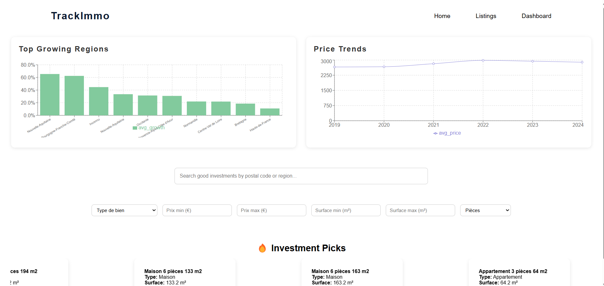
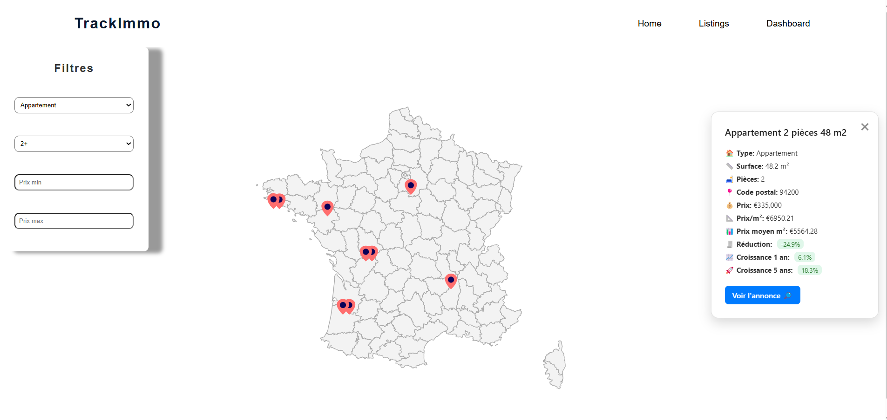
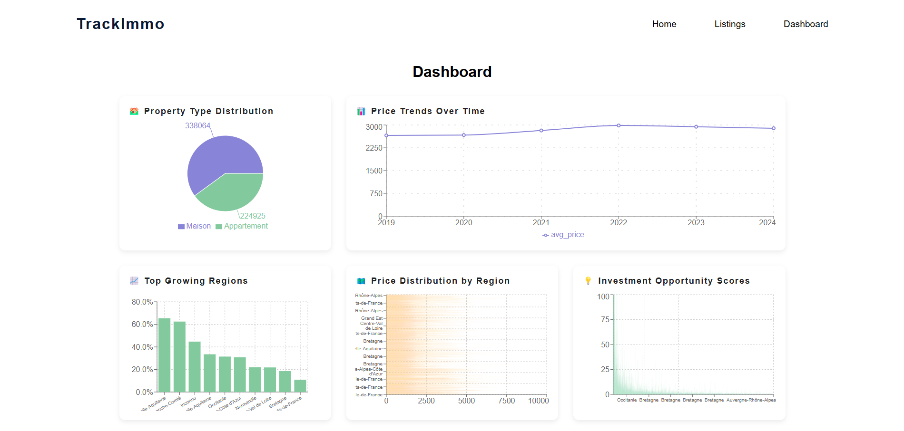

# 🏡 TrackImmo: Real Estate Investment Detection Platform

TrackImmo is a full-stack web application designed to identify real estate investment opportunities across France. It leverages **public data**, **web scraping**, and **machine learning** to provide users with valuable insights into the real estate market.

---

## 📌 Features

- 📊 Dashboard of real estate statistics (growth trends, pricing, distributions)
- 📍 Interactive map with property listings and predicted opportunities
- 🤖 Machine learning model trained on DVF (Demande de Valeur Foncière) data
- 🔍 Smart filters (price, surface, location, opportunity score)
- 🕸️ Scraping of property listings from websites (e.g., LeBonCoin)
- ☁️ Big data ingestion into Hadoop + Hive for historical analysis

---


The app consists of:

- **Frontend** (React): Map UI, filter panel, animated listings, dashboard  
- **Backend** (Flask): RESTful API, ML model endpoints, MongoDB connector  
- **Scraping Layer** (Scrapy): Real-time crawling and listing updates  
- **ML Pipeline** (Spark): DVF + listing analysis for investment scoring  
- **Big Data Layer** (Hadoop + Hive): Historical data lake + queries  

---

## 🛠️ Technologies Used

| Layer         | Tech Stack                                   |
|--------------|-----------------------------------------------|
| Frontend     | React, Axios, GSAP, Mapbox GL / Leaflet       |
| Backend      | Python, Flask, Pandas, MongoDB                |
| ML Pipeline  | PySpark, Scikit-learn / LightGBM, Optuna      |
| Scraping     | Scrapy,  Shell scripts                        |
| Data Storage | Hadoop, Hive, MongoDB                         |

---

## 📂 Project Structure

```
TrackImmo/
├── trackoimmo-app/              # React UI
├── machine/                     # Flask API and AI Model
├── camoufox/                    # Scrapy spiders
├── update.sh                    # Shell scripts for DVF ingestion
└── README.md
```

---

## ⚙️ Installation & Local Setup

### 1. Clone the Repository
```bash
git clone https://github.com/yourusername/TrackImmo.git
cd TrackImmo
```

### 2. Install Backend Requirements
```bash
cd machine
conda create -n trackimmo python=3.10
conda activate trackimmo
pip install -r environment.yml
```

### 3. Start Flask Backend
```bash
cd machine
python app.py
```

### 4. Start Frontend (React)
```bash
cd trackoimmo-app
npm install
npm start
```

---

## 🚫 What Won’t Work Without Big Data Environment

> The full ML pipeline and DVF processing scripts require:
> - Hadoop
> - Hive Metastore
> - Spark 3.x

⚠️ These are not included in this repo.

```bash
python track.py
```

---

## 📸 Screenshots
### 🏡 Home View

---

### 🔍 Listing Page with Filter Sidebar and Map


### 📈 Dashboard View



## 🚀 Deployment

- **Frontend**: Deployable via Netlify or Vercel  
- **Backend**: Deployable on Render, Railway, or VPS (with MongoDB access)  
- **MongoDB**: Cloud-hosted via MongoDB Atlas or local instance  
- **ML/Hadoop**: Only deployable on a configured Hadoop cluster or cloud (e.g., AWS EMR)  

---

## 📥 Data Sources

- [Demande de Valeur Foncière (DVF)](https://www.data.gouv.fr/fr/datasets/demandes-de-valeurs-foncieres/)
- Property listings scraped from LeBonCoin and bienici

---

## 🔄 To Do & Extensions

- [ ] Deploy entire stack in cloud using Docker or Kubernetes
- [ ] Add user accounts and favorite listings

---

## 🙋 Contact & Attribution

Made by [Youssef Ben Omrane](https://github.com/Youuusseff)  
Feel free to open an issue or reach out for collaborations or feedback!

---


